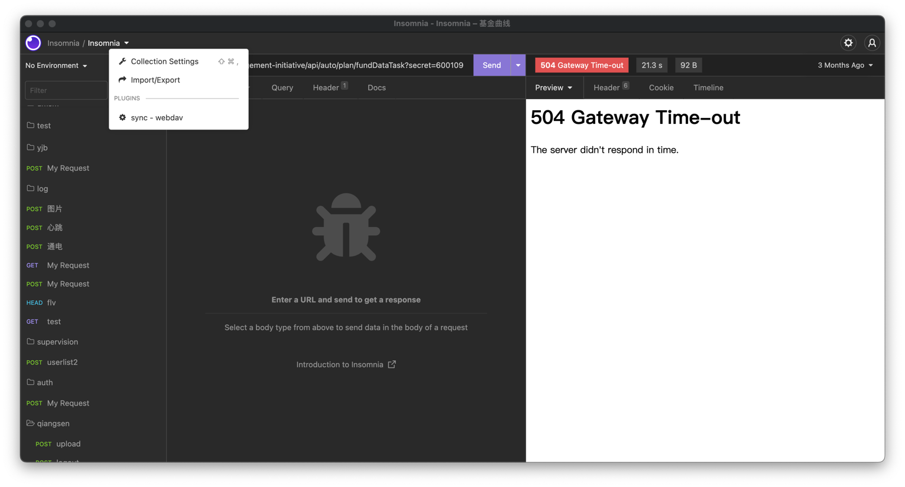
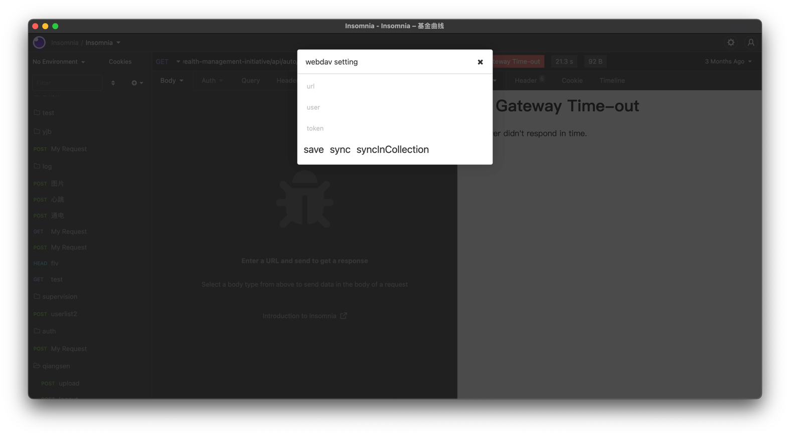

### insomnia plugin sync

insomnia plugin which support sync collection to webdav by


#### install

```shell
npm i

npm run build
```

move the dist folder to insomnia plugin folder.

then open insomnia and reload plugin.




#### usage

fill your own webdav config



* sync: sync to remote
* syncInCollection: sync and merge collection